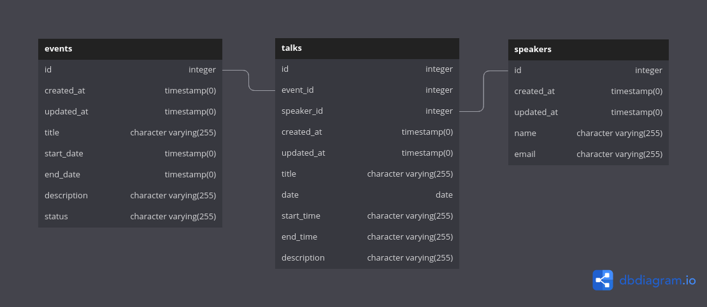

# test_else

## Base de dados

## Tecnologias

- [Symfony5](https://symfony.com/5)
- [DoctrineORM](https://www.doctrine-project.org/projects/orm.html)
- [PostgreSQL](https://www.postgresql.org/)
- [PHP8](https://www.php.net/releases/8.0/en.php)

## Rodando com Docker

### Criando .env ###

    Duplique o arquivo .env.example como .env
    
### Buildar e subir containers ###
    docker-compose -f docker-compose.yml up -d --build

### Documentação da Api no navegador
    http://localhost:8000/api/doc

### Rodando testes
    composer tests